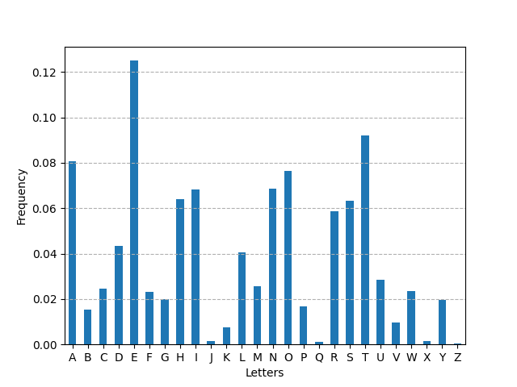
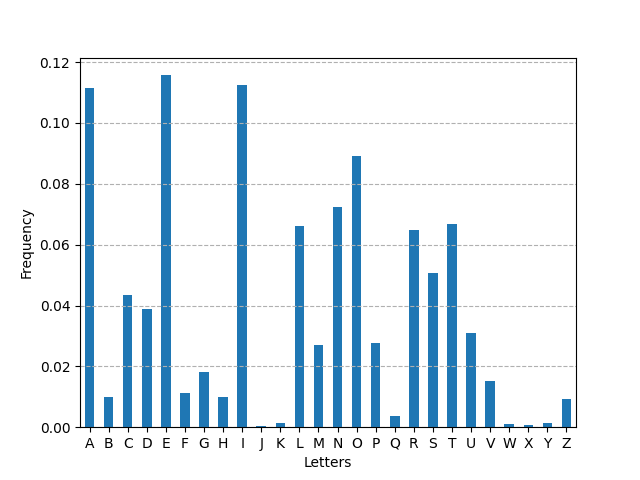
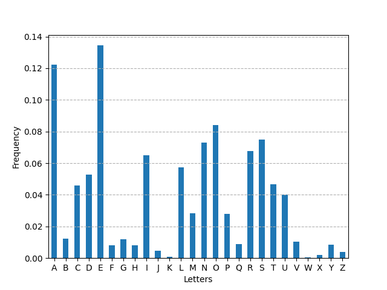
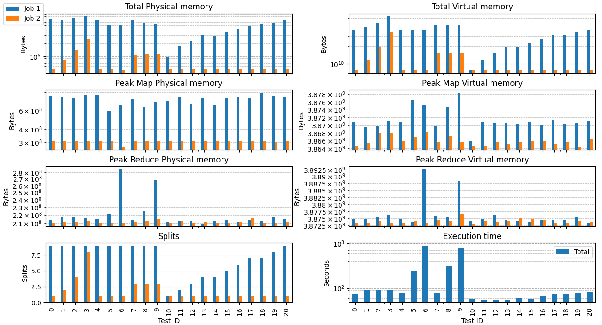
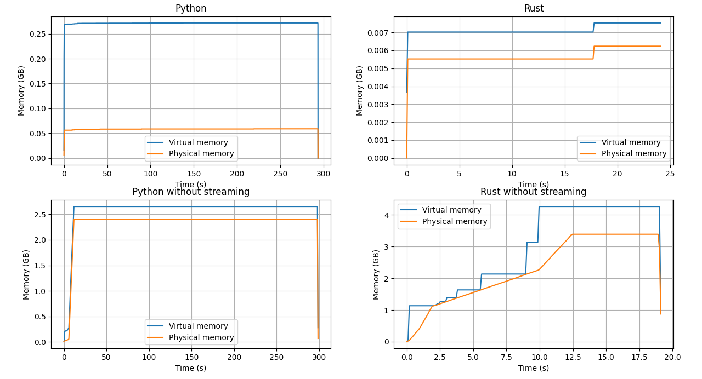

# Cloud Computing - Project Report

[Pdf version](doc/.aux/main.pdf)

## Abstract

This report presents the development and performance evaluation of a
Java-based application designed to count letter frequencies in large
datasets using the Hadoop framework. To provide a comprehensive
analysis, we also implemented and tested non-distributed applications
in Python and Rust for comparison. The results show that for the sizes
of the datasets considered, Java takes less time to complete than
Python, while Rust is significantly faster than Java. Both Python and
Rust applications used significantly less memory than the Java
application.

## Introduction

Our project for the Cloud Computing course consists of developing a Java
application to count the frequency of letters in a large dataset using
the Hadoop framework. The main objective of the project is to analyze
and compare the performance of the application with different
configurations and input sizes and also to compare it with
non-distributed implementations in Python and Rust.

## Mapreduce

MapReduce is a programming model for processing large data sets. Users
specify a map function that processes a key/value pair to generate a set
of intermediate key/value pairs, and a reduce function that merges all
intermediate values associated with the same intermediate key. For our
application we needed two subsequent MapReduce jobs: the first one to
count the occurrences of each letter in the input text and the second
one to calculate the frequency of each letter.

### Job 1: Counting letters

#### Mapper 1

For testing purposes, we created two different mappers: one with an
in-mapper combiner and one without. For the combiner (when enabled), we
used the same code as the reducer.

- **Mapper with in-mapper combiner**: This mapper stores the letter
    counts in a vector and emits them in the cleanup method. At the end
    of the cleanup method, the mapper increments a job counter with the
    number of emitted letters.

- **Mapper without in-mapper combiner**: This mapper emits the letter
    counts (with value 1) for each letter in the map method. At the end
    of the map method, the mapper increments a job counter with the
    number of emitted letters.

#### Reducer 1

The reducer receives the letter counts from the mappers and sums them
up.

### Job 2: Calculating frequencies

The results of the first job are saved in a temporary file and used as
input for the second job. The counter obtained from the first job is
stored in a configuration variable that is passed to the reducer (only
one is needed because the number of different letters is small). For
this job we do not need a combiner so it's always disabled.

#### Mapper 2

We used an identity mapper that emits the letter counts as they are.

#### Reducer 2

The reducer receives the letter counts from the mappers and calculates
the frequency of each letter using the total count that was previously
stored in a configuration variable.

## Dataset

We used three different datasets:

- **english.txt**: A 1.2GB text file containing text from the books on
[Gutenberg project](https://www.gutenberg.org/).

- **italian.txt**: A 1.3GB text file from the [PAISÀ corpus](https://www.corpusitaliano.it/).

- **spanish.txt**: A 130MB text file from the [Leipzig Corpora Collection](https://wortschatz.uni-leipzig.de/en/download/Spanish).

We also created 11 files of increasing size (from 100MB to 1.1GB with
100MB steps) to test the performance of the application with different
input sizes. These files are called **part\_XMB.txt** and contain the
first X MBs of the **english.txt** file.

## Experiments

We wrote our program in a way that allows us to configure it for the
different tests with command line arguments:

- **`-i|--input`**: Input file path inside the HDFS.

- **`-r|--reducers`**: Number of reducers to use in the first job.

- **`-n|--no-combiner`**: Disable the combiner in the first job.

- **`-m|--no-in-mapper-combiner`**: Disable the in-mapper combiner in
    the first job.

- **`-o|--output`**: Output directory path inside the HDFS, by default
    it's set to **output**.

- **`-t|--tmp`**: Temporary directory path inside the HDFS, by default
    it's set to **tmp**.

We carried out 21 tests with the configurations shown in
[Table 1](#table-1-general-tests) and
[Table 2](#table-2-input-split-tests). Originally we ran tests 7, 8 and 9
with 4 reducers, but test 9 could never complete because of a Shuffle
Error caused by a Java Heap Space error (Out Of Memory Error). Because
of this, we decided to run these tests again with 3 reducers. Only the 3
reducers configuration will be shown in the results. We also ran the
Python and Rust applications with the same input file (english.txt). We
tested two slightly different versions of the Python and Rust
applications: one that reads the input file in an asynchronous way,
discarding the parts of the file that have already been processed (file
streaming), and one that first reads the whole file into memory and then
processes it.

### Table 1: General tests

|         Test ID         |Arguments  |
|:-----------------------:|-----------|
|0|`-i english.txt -r 1`|
|1|`-i english.txt -r 2`|
|2|`-i english.txt -r 4`|
|3|`-i english.txt -r 8`|
|4|`-i english.txt -r 1 --no-combiner`|
|5|`-i english.txt -r 1 --no-in-mapper-combiner`|
|6|`-i english.txt -r 1 --no-in-mapper-combiner --no-combiner`|
|7|`-i english.txt -r 3 --no-combiner`|
|8|`-i english.txt -r 3 --no-in-mapper-combiner`|
|9|`-i english.txt -r 3 --no-in-mapper-combiner --no-combiner`|

### Table 2: Input split tests

|Test ID  |Arguments  |
|:-------:|-----------|
|10|`-i part_100MB.txt -r 1`|
|11|`-i part_200MB.txt -r 1`|
|12|`-i part_300MB.txt -r 1`|
|13|`-i part_400MB.txt -r 1`|
|14|`-i part_500MB.txt -r 1`|
|15|`-i part_600MB.txt -r 1`|
|16|`-i part_700MB.txt -r 1`|
|17|`-i part_800MB.txt -r 1`|
|18|`-i part_900MB.txt -r 1`|
|19|`-i part_1000MB.txt -r 1`|
|20|`-i part_1100MB.txt -r 1`|

### Equipment

The tests were carried out on 3 identical virtual machines, each one
with the following specifications:

- **CPU**: 1 core (2 logical cores) of an Intel(R) Xeon(R) Silver 4208
    CPU @ 2.10GHz

- **RAM**: 6.8GB

- **Disk**: 40GB

- **OS**: Ubuntu 22.04.4 LTS

The Java application used the whole equipment, while the Python and Rust
applications used only one logical core on one machine.

## Results

The results of the tests on the Java application are shown in
[Figure 4](#figure-4-tests-results-the-x-axis-represents-the-test-id).
The memory usage over time of the Python and Rust applications is shown
in [Figure 5](#figure-5-python-and-rust-memory-usage-over-time-with-and-without-file-streaming). The frequencies of the letters calculated by
the application are shown in [Figure 1](#figure-1-english-letter-frequency) for
English, [Figure 2](#figure-2-italian-letter-frequency) for Italian and
[Figure 3](#figure-3-spanish-letter-frequency) for Spanish.

### Figure 1: English letter frequency

### Figure 2: Italian letter frequency

### Figure 3: Spanish letter frequency

### Java

#### Execution time

From [Figure 4](#figure-4-tests-results-the-x-axis-represents-the-test-id)
(Execution time) we can see that the
execution time of the Java application with the complete dataset as
imput (Tests $[0,9]$) has a minimum value of 76s and a maximum value of
893s. Execution time increases significantly when the in-mapper combiner
is not used (Tests ${5,6,8,9}$) and increases further when the combiners
are also disabled (Tests ${6,9}$). More reducers lead to a slight
increase in execution time when using the in-mapper combiner (Tests
${0,1,2,3}$). Execution time of Test 9 is smaller than the one of Test 6
because the higher number of reducers helps with the processing speed of
the big amount of data produced by the mappers without in-mapper
combiners nor combiners. In all other cases, the overhead of more
reducers is not compensated by the speedup in processing. We suppose
that a big factor in this overhead is the memory usage increase due to
the necessity of a shuffle phase. On the other hand, we can see from
Tests $[10,20]$ that the execution time is almost constant ( 56s) until
the input size reaches 600MB (Test 15), after which it starts to
increase linearly up to 76s for the 1.2GB input file (Test 0).

#### Input splits

From [Figure 4](#figure-4-tests-results-the-x-axis-represents-the-test-id)
(Splits) we can see that the number of input splits
increases linearly with the input size, with a minimum of 1 for the 100MB input file (Test 10)
and a maximum of 9 for the 1.2GB input file (Test 0).
The number of input splits is not affected by the number of reducers nor by the presence of
the in-mapper combiner or the combiner.
The number of input splits of the second job is linearly proportional to the number of reducers
of the first job, in our case it is always equal to the number of reducers. This is true
becaus the dimensions of the intermediate files is small.

#### Memory usage

We can see from the top two graphs in
[Figure 4](#figure-4-tests-results-the-x-axis-represents-the-test-id)
that the memory usage of the Java application is very high, reaching
61.3GB of virtual memory in Test 3. The memory usage increases with the
number of reducers. The absence of the in-mapper combiner and the
combiner does not significantly affect the total virtual memory usage.
On the other hand, it significantly increases the virtual memory usage
of the reducers. We think that this is due to the fact the most of the
memory used by the mappers is released before the reducers start. We
also see that the total memory usage scales linearly with the input
size: with a minimum of 7.2GB for the 100MB input file (Test 10) and a
maximum of 36GB for the 1.2GB input file (Test 0). When we used 1
reducer, the memory usage of the second job was negligible compared to
the first job. With more reducers, we had more input files for the
second job, which increased the linearly the memory usage of the second
job, up to 32.4GB for 8 reducers (Test 3).

### Python

The Python application completed after 293s using file streaming and
298s without it, taking approximately 4 times more than the Java
application (Test 0). The memory usage is of 0.27GB with file streaming
and 2.65GB without it, using up to 133 times less memory than the Java
application (Test 0).

### Rust

The Rust application completed after 24s using file streaming and 19s
without it, taking 3 to 4 times less than the Java application (Test 0).
The memory usage is of 0.0075GB with file streaming and 4.26GB without
it, using up to 4800 times less memory than the Java application (Test
0). These results show the efficiency of Rust in terms of both execution
time and memory usage and the huge overhead of an interpreted language
plus the Hadoop framework.

### Figure 4: Tests results, the x-axis represents the test ID

### Figure 5: Python and Rust memory usage over time, with and without file streaming

## Conclusions

In this work we developed a Java application to count the frequency of
letters in a large dataset using the Hadoop framework. We also developed
non-distributed applications in Python and Rust for comparison. We
carried out 21 tests with different configurations and input sizes one
the Java application and one test for each Python and Rust application
then we analyzed and compared the results. The Java application is
faster than the Python application and slower than the Rust application.
The Rust application proved to be the most efficient in terms of both
execution time and memory usage, using up to 4800 times less memory than
the Java application. The Python application still used significantly
less memory than the Java application. Further improvements could be
made to augment the precision of the results, such as performing more
tests to have a more accurate average execution time and memory usage.
The results that a non-distributed, single-core, Rust application has
obtained, suggest that a distributed Rust application could be
significantly more efficient than an Hadoop application even for bigger
datasets.
